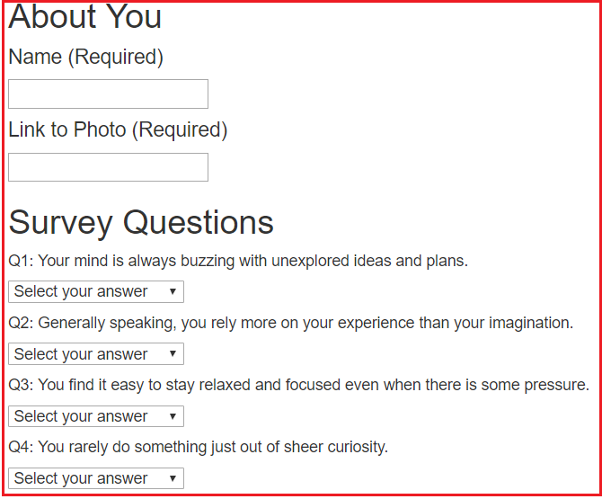

# Friend Finder

In this application, users access an online form and answer questions about themselves. The user answers are stored in a JavaScript file. After submitting the form, users are provided a name and photo of another user who might be compatable with them. The other user's answers in the online form most closely match the answers of the first user.

# Sample Screenshots

The following image shows a portion of the online form.

The following image shows the window that is displayed after submitting the form.

# Tools Used

- JavaScript
- html
- Bootstrap
- jquery
- Heroku
- npm packages:
	- express
	- body-parser
	- path   